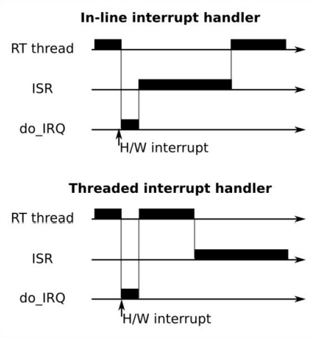

# Allot Kernel Course

## Brief
Please refer the course slides in `Linux-Kernel-Allot-2021Q4-part1.pdf` for   
full course content. The relevant code examples are located under `allot_kernel_course_sources`.   

## mknod
Make Node used to create device nodes for character devices.  
This means we can take character device minor and major numbers to create a device file node.  

For example, let check acme.c char device:  
1. Make sure that no acme is present in /proc/devices  
2. Compile acme.ko using make    
3. sudo insmod `acme.ko`   
4. Make sure that acme is present in /proc/devices    
5. Create device node for the acme (mknod acme c 92 0)   
6. Write to the device node (echo "hello world" > acme)  
7. Read from device node (cat acme).   

## /proc/devices
This file allows one to inspect the current loaded devices.
```
cat /proc/devices

Character devices:
  1 mem
  4 /dev/vc/0
  4 tty
...

Block devices:
  8 sd
  9 md
 65 sd
 66 sd
...

```

## modinfo

modinfo allows one to inspect compiled kernel object file for metadata.
```
[root@EMBD-VM-00074 src]# modinfo acme.ko
filename:       /home/student/src/acme.ko
author:         Free Electrons
description:    Example character driver
license:        GPL
srcversion:     63C55A07FA93E83D7CE3302
depends:
retpoline:      Y
name:           acme
vermagic:       5.4.17-2102.204.4.4.el8uek.x86_64 SMP mod_unload modversions
```

## slab allocator
Slab allocator is optimiesed for small memory chunks allocations.  
cat `/proc/slabinfo` file presents all available slab segments.  
`slabtop` application can be used to inspect slab managers on the system.   
 

 Example code for working with slab allocator.  
 Check `/proc/slabinfo` for the new my_cache slab.  
``` C
static struct kmem_cache *my_cachep;

static int __init hello_init(void)
{
  void* obj;

  /* 
    Note that new slab will be created only if object size param for  
    kmem_cache_create is non round number (not a pow of 2).  
  */
  my_cachep = kmem_cache_create(
    "my_cache", // Name
    1679, // Object size
    0, 
    SLAB_HWCACHE_ALIGN, 
    NULL);

  // Allocate object from cache
  obj = kmem_cache_alloc(my_cachep, GFP_KERNEL);
 
  // Release the allocated block
  kmem_cache_free(my_cachep, obj);

  return 0;
}

static void __exit hello_exit(void)
{ 
  printk(KERN_ALERT "Goodbye, cruel world\n");

  //Release the cache
  kmem_cache_destroy(my_cachep);
}

```

## /proc/iomem
Each peripheral device can have allocated memory segment.   
All allocated memory segments can be observed in `/proc/iomem` file.

``` bash
sudo cat /proc/iomem

00000000-00000fff : Reserved
00001000-000997ff : System RAM
00099800-0009ffff : Reserved
000a0000-000bffff : PCI Bus 0000:00
000c0000-000c7fff : Video ROM
000c8000-000c8fff : Adapter ROM
000cc000-000cffff : PCI Bus 0000:00
000d0000-000d3fff : PCI Bus 0000:00
000d4000-000d7fff : PCI Bus 0000:00
000d8000-000dbfff : PCI Bus 0000:00
000dc000-000fffff : Reserved
  000f0000-000fffff : System ROM
00100000-bfedffff : System RAM
  ae600000-bfdfffff : Crash kernel
bfee0000-bfefefff : ACPI Tables
bfeff000-bfefffff : ACPI Non-volatile Storage
bff00000-bfffffff : System RAM
c0000000-febfffff : PCI Bus 0000:00
  c0000000-c01fffff : PCI Bus 0000:03
  c0200000-c03fffff : PCI Bus 0000:0b
  e5d00000-e5dfffff : PCI Bus 0000:22
  e5e00000-e5efffff : PCI Bus 0000:1a
  e5f00000-e5ffffff : PCI Bus 0000:12
  e6000000-e60fffff : PCI Bus 0000:0a
  e6100000-e61fffff : PCI Bus 0000:21
  e6200000-e62fffff : PCI Bus 0000:19
  e6300000-e63fffff : PCI Bus 0000:11
...
```

## DMA (Direct Memory Access)
DMA mechanism allows peripherals to use machines memory without machines CPU  
involvement. The entity that manages this mechanism is `DMA controller`.  

For example: PCI bus can write data directly to our machines memory whithout  
using the machines CPU. 


## Interrupts

Note that some interrupts have more than one interrupt handler.  
In this case, the handlers will be called one after the other, 
 until one of them returns IRQ_HANDLED.

```
sudo cat /proc/interrupts

           CPU0       CPU1       CPU2       CPU3
  0:          4          0          0          0   IO-APIC   2-edge      timer
  1:          0          9          0          0   IO-APIC   1-edge      i8042
  8:          0          0          1          0   IO-APIC   8-edge      rtc0
  9:          0          0          0          0   IO-APIC   9-fasteoi   acpi
 12:         15          0          0          0   IO-APIC  12-edge      i8042
 14:          0       7156       4525      31048   IO-APIC  14-edge      ata_piix
 15:          0          0          0          0   IO-APIC  15-edge      ata_piix
 18:          0          0          0         60   IO-APIC  18-fasteoi   uhci_hcd:usb2
...
```

`Threaded interrupts` are interrupts that are handled in dedicated thread.   
Once the iterrupt is triggered, it only awakes the interrupt thread.  
After the thread is awaken it will be scheduled by the scheduler according to its priority.  
This mechanism prevents the top priority threads be interrupted by low  
priority interrupts (Like keyboard).

In top diagram, the RT thread is stopped for long period of time.  
In the lower diagram, the RT thread is stopped only for short period of time.  


`interrupt.c` demonstrates registration of IRQ handler to IRQ number.  

interrupt.ko recives as param the IRQ number that it will register for.  
sudo insmod ./interrupt.ko irq=1

```
sudo cat /proc/interrupts

 14:   0  7156    4525   31529  IO-APIC  14-edge  ata_piix, interrupt.ko
```

Note that after we register our interrupt handler for IRQ 14, we  
will see `interrupt.ko` in the handlers line in /proc/interrupts.

The difference between `request_threaded_irq` and `request_irq` is one extra callback param.   

``` C
/*
The handler is the callback that will be called once IRQ occures.  
It should return IRQ_WAKE_THREAD.  
Once IRQ_WAKE_THREAD is returned, thread_fn callback will be scheduled  
to run by the scheduler.
*/

int request_threaded_irq (
  unsigned int irq,
 	irq_handler_t handler,
 	irq_handler_t thread_fn,
 	unsigned long irqflags,
 	const char * devname,
 	void * dev_id);
```

## Interrupt handling mechanisms latency

Here are the mechanisms for handling work from interrupts sorted by latency:  
`Tasklets` - Lowest latency  
`Threaded interrupts` - Medium latency   
`Work queues` - Longest latency    


## Top and Bottom halves

Top and bottom halves are mechanism that used to solve the same problem as the  
threaded interrupt handler.  
Instead of the thread, tasklets are used here.  

`tesklets.c` a basic code example that calculates the time between the IRQ  
call and the tasklet run.


## Work queues
Work queues mechanism can be used to schedule work.

In work_queues.c example, we move the heavy work on interrupt to work queue.  
The performace of this method are 10 times slower than in the previous example  
that is using tasklets.

