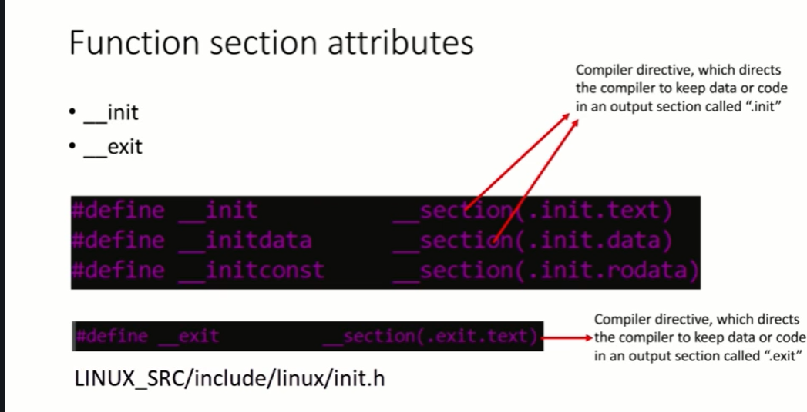
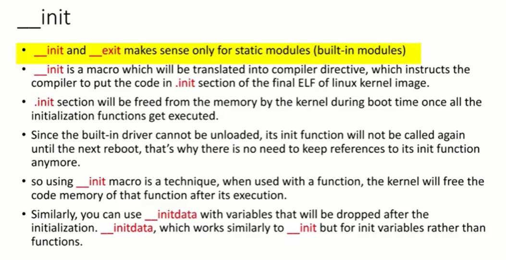
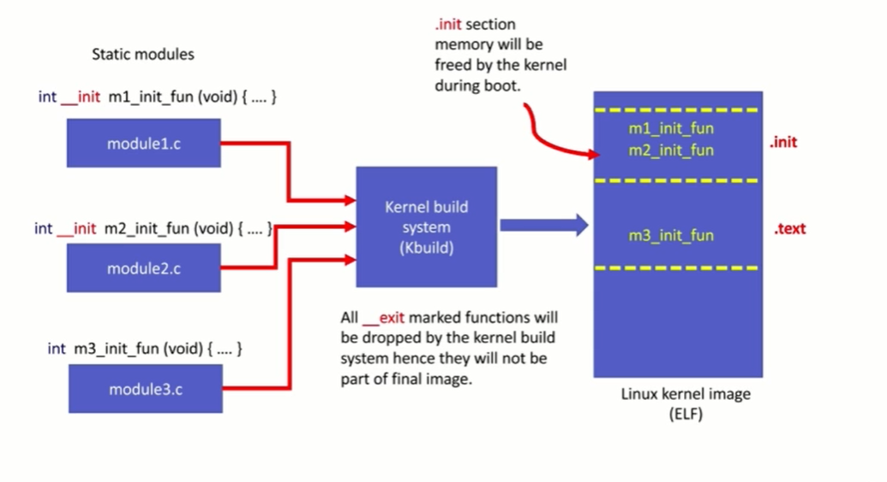
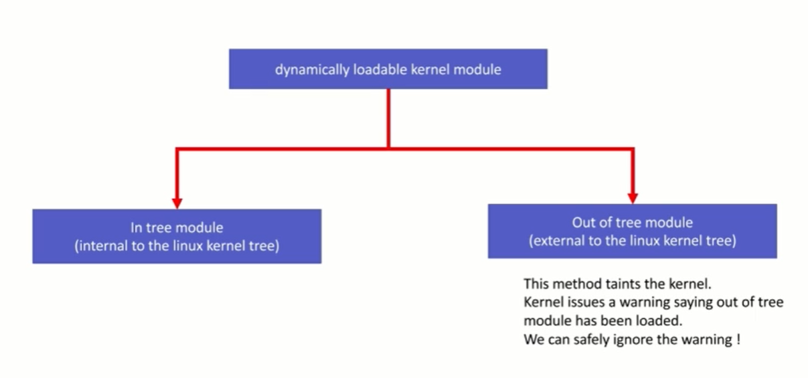
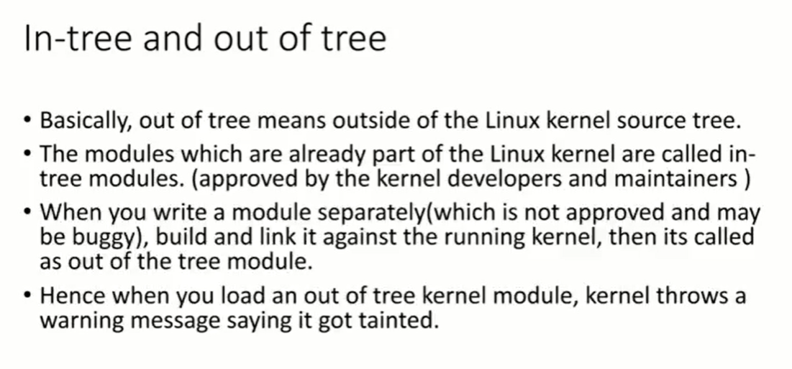
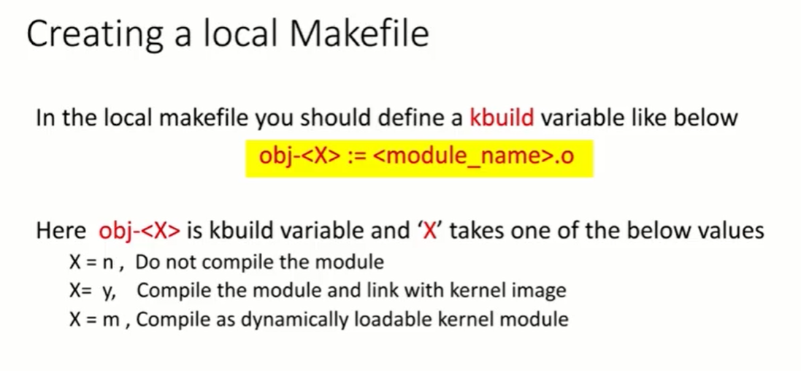
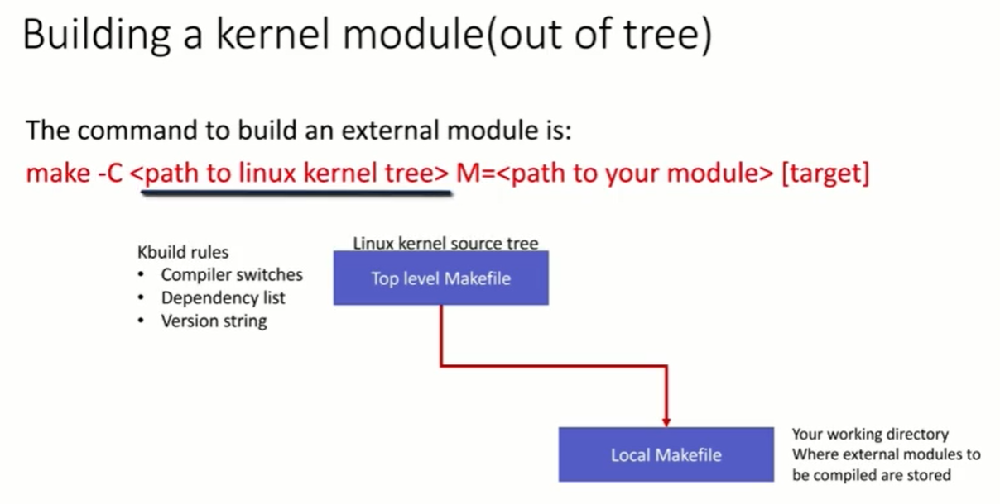

# Linux Kernel Modules

## Basic LKM structure

### Module entry point

Prototype: `int func_name(void)`

Entry point function should return 0 if the init has been done  
successfuly. Non zero return value will indicate errors and prevent  
the modules load.  

The init function should be static and should be marked with the  
`__init` macro.  

</br>

### Module exit point

Prototype: `void func_name(void)`

The exit function should be static and should be marked with the  
`__exit` macro. 

</br>

### The __init and __exit macros
 






</br>

### Hello World module example

``` C

#include<linux/module.h>

static int __init helloworld_init(void)
{
   pr_info("Hello world\n");
   return 0;
}

static void __exit helloworld_cleanup(void)
{
  pr_info("Good bye world\n");
}

module_init(helloworld_init);
module_exit(helloworld_cleanup);

MODULE_LICENSE("GPL");
MODULE_AUTHOR("Incognito");
MODULE_DESCRIPTION("A simple hello world kernel module");

```

</br>

## Compiling kernel modules

### In-tree Out-tree kernel modules



</br>



</br>

### Makefiles






</br>


