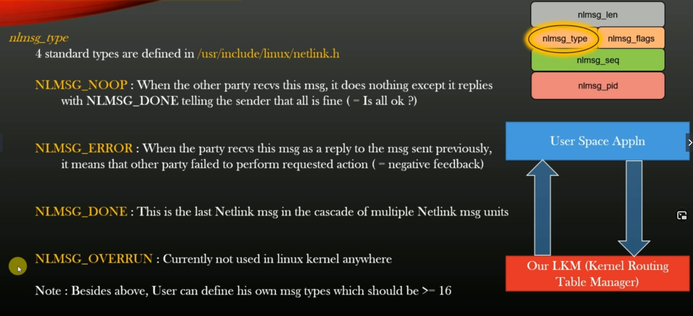
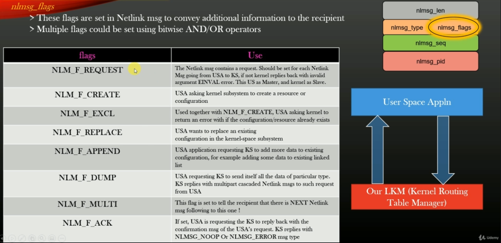
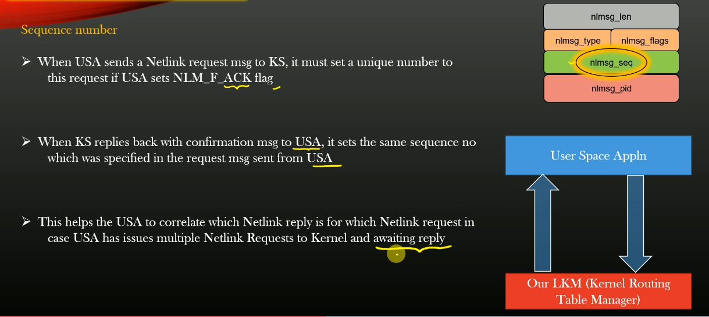
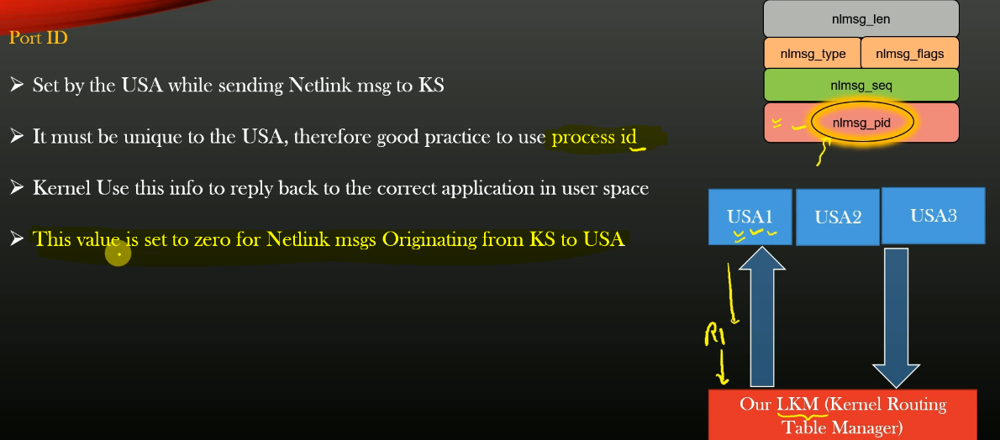

# Linux kenel netlinks

## Links

[Course source code](https://github.com/konstantin89/UdemyCourseOnNetlink)

</br>
---

## Message Structure

The nlmsghdr is defined in [netlink.h](https://elixir.bootlin.com/linux/latest/source/include/linux/netlink.h).  

```
struct nlmsghdr {
    __u32        nlmsg_len;    /* Length of message including header */
    __u16        nlmsg_type;    /* Message content */
    __u16        nlmsg_flags;    /* Additional flags */
    __u32        nlmsg_seq;    /* Sequence number */
    __u32        nlmsg_pid;    /* Sending process port ID */
};
```


### nlmsg_type

Can have the following values: 
```
#define NLMSG_NOOP        0x1    /* Nothing */
#define NLMSG_ERROR       0x2    /* Error */
#define NLMSG_DONE        0x3    /* End of a dump */
#define NLMSG_OVERRUN     0x4    /* Data lost */
```



### nlmsg_flags

All flags can be found in `netlink.h`.  
Here are some commonly used:  




### nlmsg_seq



### nlmsg_pid



